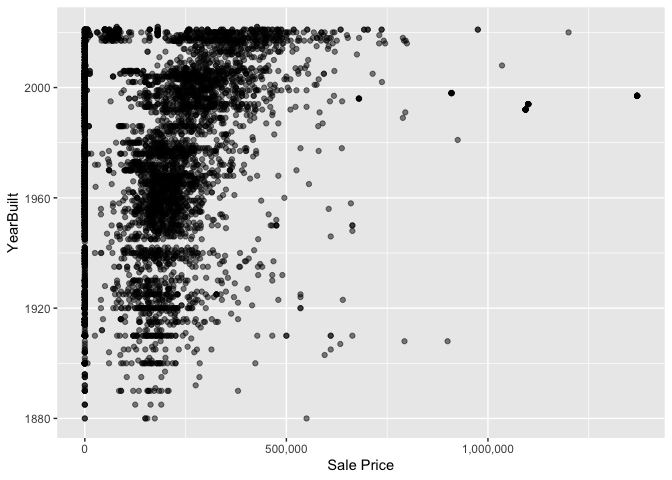

<!-- README.md is generated from README.Rmd. Please edit the README.Rmd file -->

# Lab report \#1

Follow the instructions posted at
<https://ds202-at-isu.github.io/labs.html> for the lab assignment. The
work is meant to be finished during the lab time, but you have time
until Monday evening to polish things.

Include your answers in this document (Rmd file). Make sure that it
knits properly (into the md file). Upload both the Rmd and the md file
to your repository.

All submissions to the github repo will be automatically uploaded for
grading once the due date is passed. Submit a link to your repository on
Canvas (only one submission per team) to signal to the instructors that
you are done with your submission.

# Lab Report

### Step 1 Result

``` r
library(classdata)
library(tidyverse)
```

    ## ── Attaching core tidyverse packages ──────────────────────── tidyverse 2.0.0 ──
    ## ✔ dplyr     1.1.4     ✔ readr     2.1.5
    ## ✔ forcats   1.0.0     ✔ stringr   1.5.1
    ## ✔ ggplot2   3.5.1     ✔ tibble    3.2.1
    ## ✔ lubridate 1.9.4     ✔ tidyr     1.3.1
    ## ✔ purrr     1.0.4     
    ## ── Conflicts ────────────────────────────────────────── tidyverse_conflicts() ──
    ## ✖ dplyr::filter() masks stats::filter()
    ## ✖ dplyr::lag()    masks stats::lag()
    ## ℹ Use the conflicted package (<http://conflicted.r-lib.org/>) to force all conflicts to become errors

``` r
library(ggplot2)

head(ames, 5)
```

    ## # A tibble: 5 × 16
    ##   `Parcel ID` Address      Style Occupancy `Sale Date` `Sale Price` `Multi Sale`
    ##   <chr>       <chr>        <fct> <fct>     <date>             <dbl> <chr>       
    ## 1 0903202160  1024 RIDGEW… 1 1/… Single-F… 2022-08-12        181900 <NA>        
    ## 2 0907428215  4503 TWAIN … 1 St… Condomin… 2022-08-04        127100 <NA>        
    ## 3 0909428070  2030 MCCART… 1 St… Single-F… 2022-08-15             0 <NA>        
    ## 4 0923203160  3404 EMERAL… 1 St… Townhouse 2022-08-09        245000 <NA>        
    ## 5 0520440010  4507 EVERES… <NA>  <NA>      2022-08-03        449664 <NA>        
    ## # ℹ 9 more variables: YearBuilt <dbl>, Acres <dbl>,
    ## #   `TotalLivingArea (sf)` <dbl>, Bedrooms <dbl>,
    ## #   `FinishedBsmtArea (sf)` <dbl>, `LotArea(sf)` <dbl>, AC <chr>,
    ## #   FirePlace <chr>, Neighborhood <fct>

``` r
summary(ames)
```

    ##   Parcel ID           Address                        Style     
    ##  Length:6935        Length:6935        1 Story Frame    :3732  
    ##  Class :character   Class :character   2 Story Frame    :1456  
    ##  Mode  :character   Mode  :character   1 1/2 Story Frame: 711  
    ##                                        Split Level Frame: 215  
    ##                                        Split Foyer Frame: 156  
    ##                                        (Other)          : 218  
    ##                                        NA's             : 447  
    ##                           Occupancy      Sale Date            Sale Price      
    ##  Condominium                   : 711   Min.   :2017-07-03   Min.   :       0  
    ##  Single-Family / Owner Occupied:4711   1st Qu.:2019-03-27   1st Qu.:       0  
    ##  Townhouse                     : 745   Median :2020-09-22   Median :  170900  
    ##  Two-Family Conversion         : 139   Mean   :2020-06-14   Mean   : 1017479  
    ##  Two-Family Duplex             : 182   3rd Qu.:2021-10-14   3rd Qu.:  280000  
    ##  NA's                          : 447   Max.   :2022-08-31   Max.   :20500000  
    ##                                                                               
    ##   Multi Sale          YearBuilt        Acres         TotalLivingArea (sf)
    ##  Length:6935        Min.   :   0   Min.   : 0.0000   Min.   :   0        
    ##  Class :character   1st Qu.:1956   1st Qu.: 0.1502   1st Qu.:1095        
    ##  Mode  :character   Median :1978   Median : 0.2200   Median :1460        
    ##                     Mean   :1976   Mean   : 0.2631   Mean   :1507        
    ##                     3rd Qu.:2002   3rd Qu.: 0.2770   3rd Qu.:1792        
    ##                     Max.   :2022   Max.   :12.0120   Max.   :6007        
    ##                     NA's   :447    NA's   :89        NA's   :447         
    ##     Bedrooms      FinishedBsmtArea (sf)  LotArea(sf)          AC           
    ##  Min.   : 0.000   Min.   :  10.0        Min.   :     0   Length:6935       
    ##  1st Qu.: 3.000   1st Qu.: 474.0        1st Qu.:  6553   Class :character  
    ##  Median : 3.000   Median : 727.0        Median :  9575   Mode  :character  
    ##  Mean   : 3.299   Mean   : 776.7        Mean   : 11466                     
    ##  3rd Qu.: 4.000   3rd Qu.:1011.0        3rd Qu.: 12088                     
    ##  Max.   :10.000   Max.   :6496.0        Max.   :523228                     
    ##  NA's   :447      NA's   :2682          NA's   :89                         
    ##   FirePlace                            Neighborhood 
    ##  Length:6935        (27) Res: N Ames         : 854  
    ##  Class :character   (37) Res: College Creek  : 652  
    ##  Mode  :character   (57) Res: Investor Owned : 474  
    ##                     (29) Res: Old Town       : 469  
    ##                     (34) Res: Edwards        : 444  
    ##                     (19) Res: North Ridge Hei: 420  
    ##                     (Other)                  :3622

``` r
str(ames)
```

    ## tibble [6,935 × 16] (S3: tbl_df/tbl/data.frame)
    ##  $ Parcel ID            : chr [1:6935] "0903202160" "0907428215" "0909428070" "0923203160" ...
    ##  $ Address              : chr [1:6935] "1024 RIDGEWOOD AVE, AMES" "4503 TWAIN CIR UNIT 105, AMES" "2030 MCCARTHY RD, AMES" "3404 EMERALD DR, AMES" ...
    ##  $ Style                : Factor w/ 12 levels "1 1/2 Story Brick",..: 2 5 5 5 NA 9 5 5 5 5 ...
    ##  $ Occupancy            : Factor w/ 5 levels "Condominium",..: 2 1 2 3 NA 2 2 1 2 2 ...
    ##  $ Sale Date            : Date[1:6935], format: "2022-08-12" "2022-08-04" ...
    ##  $ Sale Price           : num [1:6935] 181900 127100 0 245000 449664 ...
    ##  $ Multi Sale           : chr [1:6935] NA NA NA NA ...
    ##  $ YearBuilt            : num [1:6935] 1940 2006 1951 1997 NA ...
    ##  $ Acres                : num [1:6935] 0.109 0.027 0.321 0.103 0.287 0.494 0.172 0.023 0.285 0.172 ...
    ##  $ TotalLivingArea (sf) : num [1:6935] 1030 771 1456 1289 NA ...
    ##  $ Bedrooms             : num [1:6935] 2 1 3 4 NA 4 5 1 3 4 ...
    ##  $ FinishedBsmtArea (sf): num [1:6935] NA NA 1261 890 NA ...
    ##  $ LotArea(sf)          : num [1:6935] 4740 1181 14000 4500 12493 ...
    ##  $ AC                   : chr [1:6935] "Yes" "Yes" "Yes" "Yes" ...
    ##  $ FirePlace            : chr [1:6935] "Yes" "No" "No" "No" ...
    ##  $ Neighborhood         : Factor w/ 42 levels "(0) None","(13) Apts: Campus",..: 15 40 19 18 6 24 14 40 13 23 ...

Variables:

1.  Parcel ID (chr) - An unique ID
2.  Address (chr) - Address of property
3.  Style (Factor) - Number of stories
4.  Occupancy (Factor) - Type of property
5.  Sale Date (Date) - Date of sale
6.  Sale Price (num) - Sale price
7.  Multi Sale (chr) - Multiple sales
8.  YearBuilt (num) - The year it was built
9.  Acres (num) - Acres of the property
10. TotalLivingArea (sf) (num) - Total living area of property
11. Bedrooms (num) - Number of bedrooms
12. FinishedBsmtArea (sf) (num) - Basement area
13. LotArea (sf) (num) - Lot area
14. AC (chr) - Availability of AC
15. FirePlace (chr) - Availability of fire place
16. Neighborhood (Factor) - Neighborhood it belong in

Variables with chr type have no restriction in data range, could be any
string or they could be categorical data.

Variables with Date type has a format of year-month-date

Variables with num type have an infinite data range of any number

Varibles with Factor type have categorical data stored on different
levels of a data structure but no restriction on number of levels

### Step 2 Result

The variable of special interest is Sale Price. When exploring various
relationships with other variables, Sale Price seems to result in the
most correlation. Living Area, Year Built, and Neighborhood seem to have
some correlation with Sale Price. We think there might be a correlation
between Sale Price and acreage as well.

### Step 3 Result

``` r
library(classdata)
library(ggplot2)

#summary(ames)

#ames$`Sale Price`
hist <- ggplot(ames, aes(x=log(`Sale Price`))) + geom_histogram(binwidth=.1) + ggtitle("Histogram for Sale Price of Residential Sales in Ames")  + labs(x="Sale Price")
hist
```

    ## Warning: Removed 2206 rows containing non-finite outside the scale range
    ## (`stat_bin()`).

<!-- -->

``` r
#range(ames$`Sale Price`)
```

The range of the variable is 0 to 20,500,000 with 0 as the minimum and
20,500,000 as the maximum.

As you can see, the histograms most common values are from about 12-13
on the log scale. If we wanted to look at the numerical values for Sale
Price I would estimate (since our x values are measured in log(Sale
Price)) that it would fall between about 162,755 dollars and about
442,413 dollars.

As for oddities, I think it’s strange that for some houses the sale
price is 0. I also think that there are some very high values as
outliers, to the right of the largest part of the histogram, especially
considering how many of these outliers there are.

### Step 4 Result

Nadia’s work: I selected the square feet of living area. Based on the
histogram, it appers the data are slightly right-skewed, and that square
footage around 1000-1500 is most common. I decided to drop rows with NA
values, or those with price or square footage listed as 0, as these were
likely errors. After making a scatterplot, I saw that there was only a
small positive correlation between price and size, which surprised me. I
also noticed that there were a few houses with prices so high that it
made the plot difficult to read, so I ran the prices through a log
function first.

``` r
#Nadia
df <- ames['TotalLivingArea (sf)']
df['Price'] <- ames['Sale Price']
df['SqFtLiving'] <- ames['TotalLivingArea (sf)']
df <- drop_na(df)
df <- filter(df, Price>0, SqFtLiving>0)
ggplot(df, aes(x=SqFtLiving)) +
  geom_histogram(binwidth = 100)
```

<!-- -->

``` r
ggplot(df, aes(x=SqFtLiving, y=log(Price))) +
  geom_point()
```

<!-- -->

Hong Hao’s work: YearBuilt vs Sale Price

``` r
library(ggplot2)

ames_clean <- subset(ames, !is.na(ames$`Sale Price`) & !is.na(ames$YearBuilt))
ames_clean$`Sale Price` <- as.numeric(ames_clean$`Sale Price`)
ames_clean$YearBuilt <- as.numeric(ames_clean$YearBuilt)

ames_clean <- subset(ames_clean, `Sale Price` < 3000000)
ames_clean <- subset(ames_clean, YearBuilt >= 1800)

ggplot(ames_clean, aes(x = `Sale Price`, y = YearBuilt)) +
  geom_point(alpha = 0.5) +
  scale_x_continuous(labels = scales::comma)
```

<!-- -->

This is a scatterplot showing the relation between YearBuilt and Sale
Price. The YearBuilt data range from 1880 and onward, Sale Price range
from 0 to millions. We can see from the plot that there is a slight
trend of average properties’ price increasing as the year progresses
closer to the present. While creating the plot, there were 2 Sale Price
outliers that have price above 10 million and 1 YearBuilt outlier which
is at 0. These outliers were cleaned out of the data in order to see the
trend.

Kaitlyn’s work: Acres

``` r
df2 <- ames['Acres']
df2['Sale Price'] <- ames['Sale Price']
df2['Acres'] <- ames['Acres']
df2 <- drop_na(df2)

ggplot(df2, aes(x = `Acres`, y = log(`Sale Price`))) +
  geom_point(alpha = .1)
```

<!-- -->

``` r
range(df2$`Acres`)
```

    ## [1]  0.000 12.012

This is a scatterplot showing the relationship between Sales Price and
Acreage.  
The range of Acres is 0.000 to 12.012. It doesn’t seem like there is
much of a pattern between Acres and Sales Price, which I found
surprising. As you can see in the scatterplot, the majority of sales
have low acreage and relatively low prices. The spaces with darker blobs
have more data points, controlled by the alpha value.  
If there was a strong relationship, we should have seen some sort of
strong visible trend line, but in this graph we really just have a large
blob of points, with a few points heading straight out and then
outliers.  
There are a few outliers, with very low acreage and very high Sales
Price, and with high acreage and low Sales Price for that much acreage.
I found these outliers to be strange, as I’d imagine acreage is
generally quite valuable, but I don’t know the full details of the
sale.  
This doesn’t describe the outliers in question 3.
